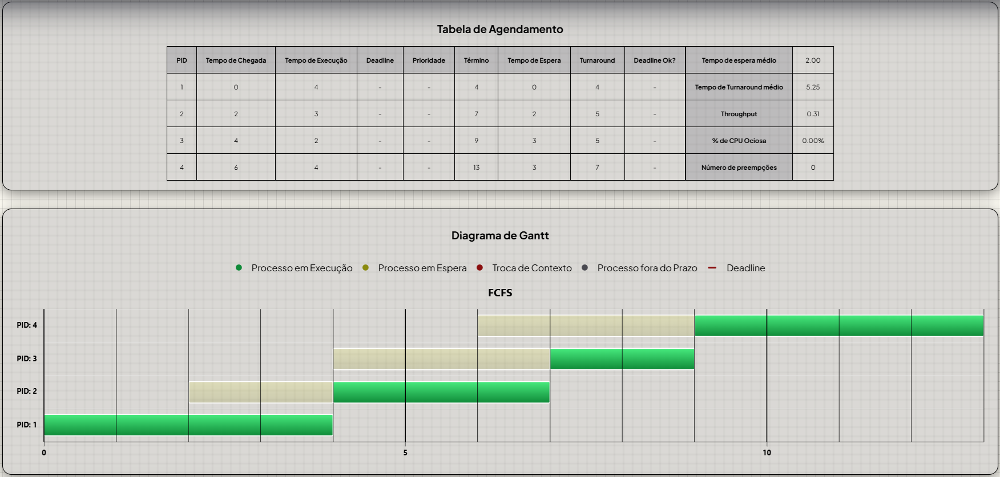

# Simulador de Escalonamento de Processos

[](https://opensource.org/licenses/MIT)
[](https://developer.mozilla.org/pt-BR/docs/Web/JavaScript)
[]()

Uma aplicação web interativa desenvolvida em JavaScript para simular, visualizar e analisar quantitativamente o comportamento de algoritmos de escalonamento de processos em sistemas operacionais. 

Este projeto foi desenvolvido como parte dos requisitos práticos da disciplina **MATA58 - Sistemas Operacionais**.

---

## Utilização

**[Acesse o simulador](URL_DO_GITHUB_PAGES_OU_DEPLOY)**

---
## Como Executar o Projeto Localmente

Como a aplicação foi desenvolvida puramente em ambiente web, executá-la é extremamente simples.

```bash
# 1. Clone o repositório
git clone https://github.com/Linnzin/escalonadores_so.git

# 2. Acesse o diretório do projeto
cd escalonadores_so

# 3. Abra o index.html através de um servidor de desenvolvimento local (recomendação: Live Server para VSCode)
```

---

### Passo a Passo de Utilização do Simulador
```bash
# 1. Acesse a página inicial.

# 2. Clique no escalonador de sua escolha.

# 3. Insira os dados do processo a ser inserido no campo "Configuração do Escalonador". 

# 4. Clique em  "Adicionar Processo (+)" para adicionar um processo com os dados estabelecidos à fila.

# 5. Repita os passos 3 e 4 para adicionar demais processos.

# 6. Caso queira remover um ou mais processos, clique em "Remover Processo (-)". Esse botão remove o último processo inserido, em sequência.

# 7. Ao terminar de adicionar processos, clique em "Simular Escalonador" para ter a Tabela Final e o Diagrama de Gantt.

# 8. Observação: o "Quantum" e a "Sobrecarga de Contexto" são fixos e definidos a partir dos valores presentes no último processo inserido.
```

---

## Visualização da Interface

![Gráfico de Gantt e Tabela de Métricas] 

---

## Funcionalidades e Algoritmos

O simulador foi construído utilizando o paradigma de **Simulação de Eventos Discretos**, garantindo precisão matemática no cálculo dos tempos do sistema.

### Algoritmos Implementados:
1. **FIFO/FCFS** (First Come, First Served) - *Não preemptivo*.
2. **SJF** (Shortest Job First) - *Não preemptivo*.
3. **Prioridade** - *Não preemptivo*.
4. **Round-Robin** - *Preemptivo com quantum fixo*.
5. **EDF** (Earliest Deadline First) - *Preemptivo*.
6. **Maior Folga (MLF)** - *Algoritmo preemptivo autoral desenvolvido pela equipe*.

### Funcionalidades Técnicas:
* **Entradas Dinâmicas:** Permite configurar atributos por processo (ID, Tempo de Chegada, Tempo de Execução, Prioridade e Deadline).
* **Parâmetros Globais:** Permite configurar o `quantum` e `sobrecarga_contexto`.
* **Gráfico de Gantt Interativo:** Renderização visual seguindo a especificação de cores:
  * Verde: Execução de Processo.
  * Vermelho: Sobrecarga de Contexto.
  * Cinza: Estouro de Deadline.
  * Linha Vertical: Indicação de Deadline.
* **Métricas Completas:** Geração automática de relatórios de desempenho individuais e estatísticas globais (Turnaround, Tempo de Espera, Throughput e % de Ociosidade).

---

## Organização do Código

O projeto foi estruturado de forma modular, buscando separar a lógica matemática de escalonamento da camada de manipulação visual:

* **`/script/escalonadores/`**: Contém a lógica pura de cada simulador (funções de escalonamento de cada algoritmo).
* **`/html/`**: Gerenciamento da interface, captura dos inputs do usuário e renderização dinâmica do Gráfico de Gantt no DOM.
* **`/script/main.js`**: Funções gerais para cálculo automatizado das métricas e funcionamento dos escalonadores.

---

## Tecnologias Utilizadas

* **Linguagem Principal:** JavaScript (ES6+)
* **Interface e Estilização:** HTML5 / CSS3
* **Bibliotecas:** Highcharts

---


## Autores
Desenvolvido por:

Lincoln Pereira da Silva - [GitHub](https://github.com/Linnzin) | [LinkedIn](https://www.linkedin.com/in/lincolnps21/)

Guilherme de Santana Soares Xavier - [GitHub](https://github.com/DasGestirn) | [LinkedIn](https://www.linkedin.com/in/guilherme-xavier-61a54639a/)

Jacques Barreto Salah - [GitHub](https://github.com/JacquesSalah) | [LinkedIn](https://www.linkedin.com/in/jacques-salah/)

## Licença
Este projeto está sob a licença MIT. Veja o arquivo LICENSE para mais detalhes.